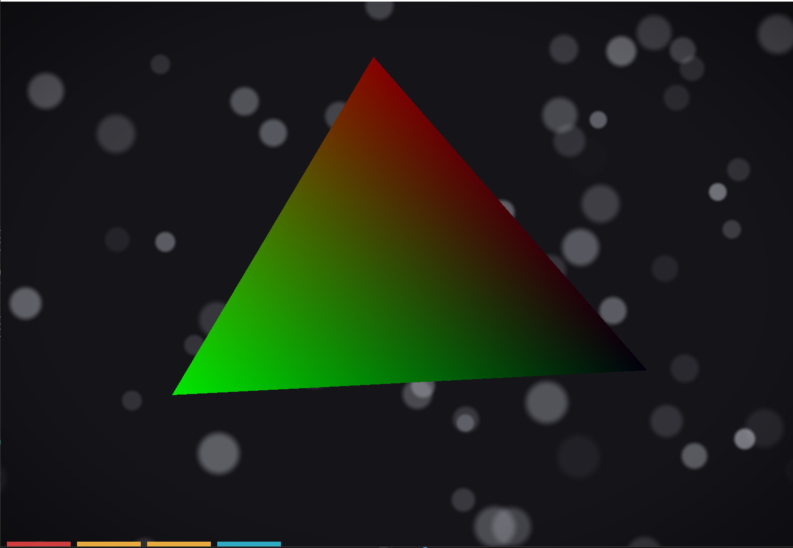

# 🎨 RGB Triangle — Effects and GUI (OpenTK)

A simple demonstration project in **C#** using **OpenTK** and **OpenGL 3.3**, showcasing basic graphics, shaders, and a simple GUI with smoke and vignette effects.

---

## 📸 Screenshot



---

## ✨ Key Features

- 🔺 **Animated RGB Triangle** — smooth color transitions and rotation with direction control  
- 🖱️ **Interactive Buttons** — start/pause, change rotation direction, toggle smoke effect  
- 🌫️ **Simple Smoke Effect** — particles with smooth fading and random movement  
- 🎨 **Vignette** — darkening of window edges with adjustable intensity  
- 📐 **Orthographic Projection** and basic transformation matrices  
- ⌨️ Mouse and keyboard controls (Esc to exit)  

---

## 🧩 Project Structure

- `/Shaders` — GLSL vertex and fragment shader code  
- `/Gui` — Buttons and GUI logic with click handling  
- `/Particles` — Simple particle system for smoke effect  
- `RgbTriangleWindow.cs` — Main window rendering and logic  
- `Program.cs` — Application entry point  

---

## 🚀 Installation and Running the Project

### 1. Clone the repository

```bash
git clone https://github.com/YOUR_USERNAME/OpenTK-RGB-Triangle.git
cd OpenTK-RGB-Triangle
```

---

### 2. Install dependencies

- Make sure you have **.NET 6.0 or higher** installed:  
  Download from [https://dotnet.microsoft.com/download](https://dotnet.microsoft.com/download)

- All necessary NuGet packages are included in the project and will be restored automatically on build.

---

### 3. Run the project

- Open the project in Visual Studio / Rider and press **Run (F5)**.  
- Or run from the terminal:

```bash
dotnet run
```

---

### 4. Usage

- Control rotation, smoke, and vignette effects with mouse and keyboard  
- Press **Esc** to exit the application

---

### 5. Enjoy the animation and interaction! 🎉

---

## 🧠 What I Learned

- Working with **OpenGL** through OpenTK in C#  
- Creating and compiling GLSL shaders  
- Using VAO/VBO to store vertex data  
- Building GUI using rectangles and transformation matrices  
- Implementing a simple particle effect  
- Managing application state via mouse and keyboard event handlers  

---

## 📚 Technologies and Tools

- **C# 11**  
- **.NET 6 / 7**  
- **OpenTK 4**  
- **OpenGL 3.3 Core Profile**  
- **GLSL 330**  

---

## 📎 License

MIT License — feel free to use and modify.

---

Made with ❤️ by **SaySubr**
